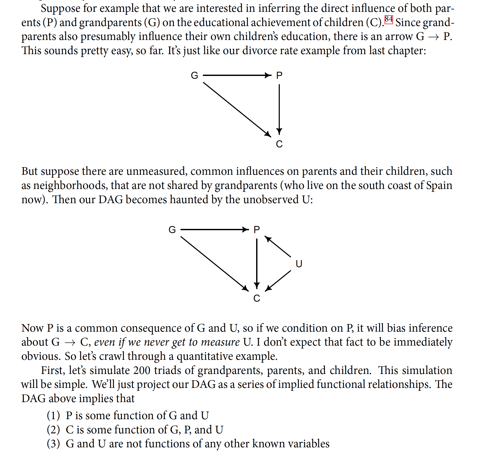
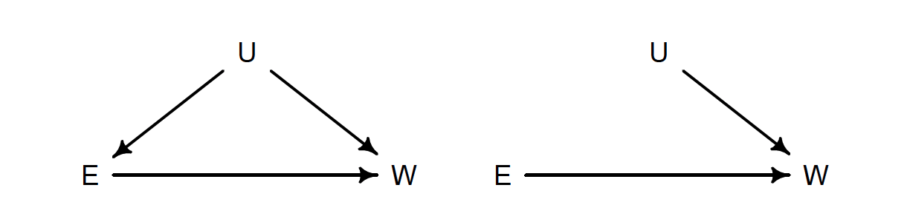
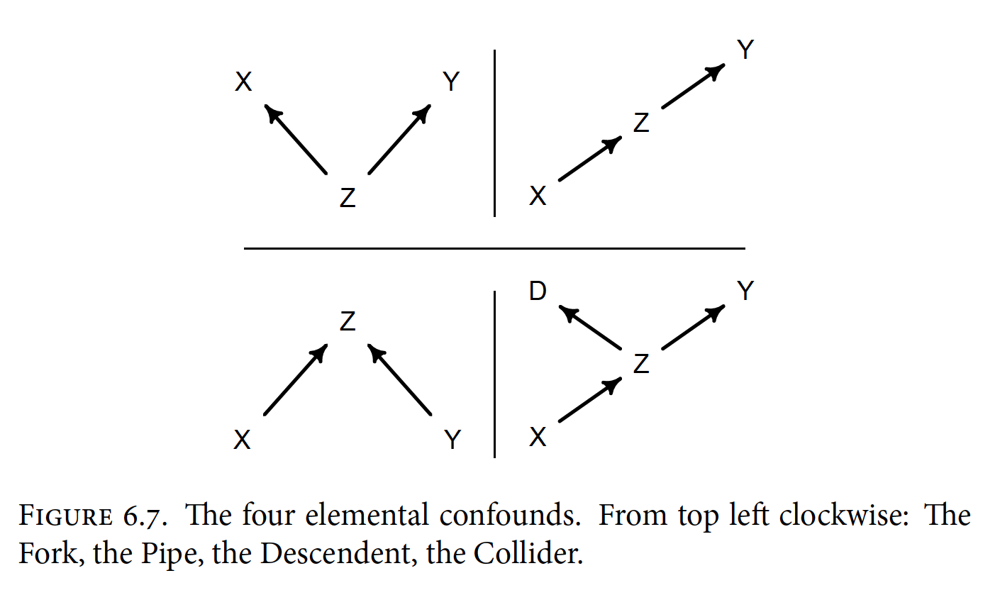
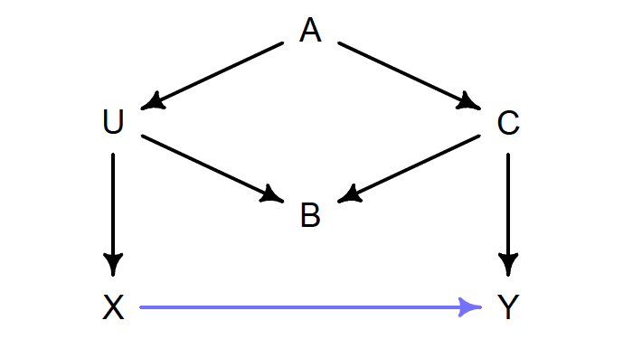

```{r}
library(rethinking)
```


Berkson's paradox / selection distortion effect 

Collider bias: the act of adding a predictor induces statistical selection within the model.

Thiscan mislead us into believing, for exampe, that there is a negative assocation between newsworthiness and trustoworthiness in general. 


### Overthinking: Simulated science distortion 
```{r}
set.seed(1914)
N <- 200 # num grant proposals
p <- 0.1 # proportion to select
# uncorrelated newsworthiness and trustworthiness
nw <- rnorm(N)
tw <- rnorm(N)
# select top 10% of combined scores
s <- nw + tw # total score
q <- quantile( s , 1-p ) # top 10% threshold
selected <- ifelse( s >= q , TRUE , FALSE )
cor( tw[selected] , nw[selected] )
```

## 6.1 Multicollinearilty
Multicollinearity means very strong correlation between two or more predictor variables. The consequence of it is that the posterior distribution will seem to suggest that none of the variables is reliably associated with the outcome, even if all of the variables are in reality strongly associated with the outcome. 

### 6.1.1 Multicollinear legs 


# Generate synthetic dataset 
```{r}
N <- 100 # number of individuals 6.2
set.seed(909)
height <- rnorm(N,10,2) # sim total height of each
leg_prop <- runif(N,0.4,0.5) # leg as proportion of height
leg_left <- leg_prop*height + # sim left leg as proportion + error
rnorm( N , 0 , 0.02 )
leg_right <- leg_prop*height + # sim right leg as proportion + error
rnorm( N , 0 , 0.02 )
# combine into data frame
d <- data.frame(height,leg_left,leg_right)
```

```{r}
m6.1 <- quap(
alist(
height ~ dnorm( mu , sigma ) ,
mu <- a + bl*leg_left + br*leg_right ,
a ~ dnorm( 10 , 100 ) ,
bl ~ dnorm( 2 , 10 ) ,
br ~ dnorm( 2 , 10 ) ,
sigma ~ dexp( 1 )
) ,
data=d )

m6.2 <- quap(
alist(
height ~ dnorm( mu , sigma ) ,
mu <- a + bl*leg_left + br*leg_right ,
a ~ dnorm( 10 , 100 ) ,
bl ~ dnorm( 2 , 10 ) ,
br ~ dnorm( 2 , 10 ) ,
sigma ~ dexp( 1 )
) ,
data=d )


precis(m6.1)
```

```{r}
a <- coeftab(m6.1)
coeftab_plot(a  )

```
```{r}
post <- extract.samples(m6.1) 
plot( bl ~ br , post , col=col.alpha(rangi2,0.1) , pch=16 )
```
```{r}
sum_blbr <- post$bl + post$br
dens( sum_blbr , col=rangi2 , lwd=2 , xlab="sum of bl and br" )
```

If you fit a regression with only one of the leg length variables, you'll get 

```{r}
m6.2 <- quap(
alist(
height ~ dnorm( mu , sigma ) ,
mu <- a + bl*leg_left,
a ~ dnorm( 10 , 100 ) ,
bl ~ dnorm( 2 , 10 ) ,
sigma ~ dexp( 1 )
) ,
data=d )
precis(m6.2)
```

When two predictor variables are very strongly correlated, including both in a model may lead to confusion. 

## 6.1.2 Multicollinear milk 

```{r}
data(milk)
d <- milk
d$K <- scale( d$kcal.per.g )
d$F <- scale( d$perc.fat )
d$L <- scale( d$perc.lactose )
```

Start by modeling kcal.per.g as a function of perc.fat and perc.lactose, but in two bivariate regressions. 

```{r}
# kcal.per.g regressed on perc.fat 6.9
m6.3 <- quap(
alist(
K ~ dnorm( mu , sigma ) ,
mu <- a + bF*F ,
a ~ dnorm( 0 , 0.2 ) ,
bF ~ dnorm( 0 , 0.5 ) ,
sigma ~ dexp( 1 )
) , data=d )
# kcal.per.g regressed on perc.lactose
m6.4 <- quap(
alist(
K ~ dnorm( mu , sigma ) ,
mu <- a + bL*L ,
a ~ dnorm( 0 , 0.2 ) ,
bL ~ dnorm( 0 , 0.5 ) ,
sigma ~ dexp( 1 )
) , data=d )
precis( m6.3 )
precis( m6.4 )
```
The posterior distributions for bF and bL are essential mirrior images of each other. Given the strong association of each predictor with the outcome, we might conclude that both variables are reiable predictors of total energy in milk across species. 

Watch what happens when we place both predictor variables in the same regreesion models. 

```{r}
m6.5 <- quap(
alist(
K ~ dnorm( mu , sigma ) ,
mu <- a + bF*F + bL*L ,
a ~ dnorm( 0 , 0.2 ) ,
bF ~ dnorm( 0 , 0.5 ) ,
bL ~ dnorm( 0 , 0.5 ) ,
sigma ~ dexp( 1 )
) ,
data=d )
precis( m6.5 )
```

Now the posterior means of both bF and bL are closer to zero. The SD for both parameters are twice as large as in thebivariate models ..

Essentially both variables contain much of the same information. They are almost substitute of each other. As a result, when you include both in regression, the posterior distributino ends up describing a long ridge of combinations of bF and bL that are equally plausible. 

```{r}
pairs( ~ kcal.per.g + perc.fat + perc.lactose , data=d , col=rangi2 )
```

The two variables are negatively correlated, and so strongly so that they are nearly redundant. Either helps in predicting kcal.per.g, but neither helps much once you already know the other. \

```{r}
cor(d$perc.fat, d$perc.lactose)
```
Correlations do have to get pretty high before redundant data doesn't matter. What matters isn't just the correlation betwen a pair of variables. Rather what matters is the corrrelation that remains after accounting for any other predictors. 

### What can be done about multicollinearity? 
The best thing to do is be aware of it. You can anticipate this problem by checking the predictor variables against one another in a pairs plot. Any pair or cluster of variables with very large correlations, over about 0.9, may be problematic once included in the same model. 

Principle Components of Factor Analysis - different disciplines deal have different conventions for dealing with collinear variables.

Non-Identifiability: A family of problems with fitting models 


#### Overthinking: Simulating collinearity 
```{r}
data(milk)
d <- milk
sim.coll <- function( r=0.9 ) {
d$x <- rnorm( nrow(d) , mean=r*d$perc.fat ,
sd=sqrt( (1-r^2)*var(d$perc.fat) ) )
m <- lm( kcal.per.g ~ perc.fat + x , data=d )

sqrt( diag( vcov(m) ) )[2] # stddev of parameter
}
rep.sim.coll <- function( r=0.9 , n=100 ) {
stddev <- replicate( n , sim.coll(r) )
mean(stddev)
}
r.seq <- seq(from=0,to=0.99,by=0.01)
stddev <- sapply( r.seq , function(z) rep.sim.coll(r=z,n=100) )
plot( stddev ~ r.seq , type="l" , col=rangi2, lwd=2 , xlab="correlation" )
```
For each correlation value in r.seq, the code generates 100 regressions and returns the average standard devation from them. 

## 6.2 Post Treatment Bias 
Omitted variable bias: mistaken inferences that arise from omitting predictor variables 
post treatment bias: mistaken inferences arising from including variables that are consequences of other variables. 

Simulating some data to understand post treatment bias 
```{r}
set.seed(71)
# number of plants
N <- 100
# simulate initial heights
h0 <- rnorm(N,10,2)
# assign treatments and simulate fungus and growth
treatment <- rep( 0:1 , each=N/2 )
fungus <- rbinom( N , size=1 , prob=0.5 - treatment*0.4 )
h1 <- h0 + rnorm(N, 5 - 3*fungus)
# compose a clean data frame
d <- data.frame( h0=h0 , h1=h1 , treatment=treatment , fungus=fungus)
precis(d)
```
### 5.2.1 A prior is born 
```{r}
sim_p <- rlnorm( 1e4 , 0 , 0.25 ) 
precis( data.frame(sim_p) )
```

```{r}
m6.6 <- quap(
alist(
h1 ~ dnorm( mu , sigma ),
mu <- h0*p,
p ~ dlnorm( 0 , 0.25 ),
sigma ~ dexp( 1 )
), data=d )
precis(m6.6)
```
```{r}
m6.7 <- quap(
alist(
h1 ~ dnorm( mu , sigma ),
mu <- h0 * p,
p <- a + bt*treatment + bf*fungus,
a ~ dlnorm( 0 , 0.2 ) ,
bt ~ dnorm( 0 , 0.5 ),
bf ~ dnorm( 0 , 0.5 ),
sigma ~ dexp( 1 )
), data=d )
precis(m6.7)
```

We see that the parameter is the same as p before.. And it has nearly the same posterior.. What has happened? We know that there was a decrease in growth but for now the model has it having little effect. 

### 6.2.2 Blocked by consequence 
The problem is that fungus is mostly a consequence of treatment. 

```{r}
m6.8 <- quap( 
alist(
h1 ~ dnorm( mu , sigma ),
mu <- h0 * p,
p <- a + bt*treatment,
a ~ dlnorm( 0 , 0.2 ),
bt ~ dnorm( 0 , 0.5 ),
sigma ~ dexp( 1 )
), data=d )
precis(m6.8)
```

Now the impact of treatment is clearly positive, as it should be. It makes sense to control for pre-treatment differences, like the initial height h0, that might mask the causal influence of treatment. But including post-treatment variables can actually mask the treatment itself. 

###6.2.3 Fungus and d-separation 
```{r}
library(dagitty)
plant_dag <- dagitty( "dag {
H0 -> H1
F -> H1
T -> F
}")
coordinates( plant_dag ) <- list( x=c(H0=0,T=2,F=1.5,H1=1) ,
y=c(H0=0,T=0,F=1,H1=2) )
plot( plant_dag )
```

As we can see, fungus is influenced by the treatment... 

D-spearation: d stands for dependence. d-separation means that some variables are indepent of thers, given that we condition on some other sets of variables. In this case, H1 is d-separated from T when we condition on F. If we do not condition on F, then they are not de-sparated. 


```{r}
dseparated( plant_dag , "T" , "H1" )
dseparated( plant_dag , "T" , "H1" , "F" )
```

```{r}
impliedConditionalIndependencies( plant_dag )
```

$_||_$ means independent of..


The problem of post-treatment variables applies just as well to obserational studies as it does to experiments. But in experients, it can be easy to tell which variables are predtreatment, like h0, and which are post-treatment, like fungus. 

## 6.3  Collider bias 

Let think about the following DAG 
T - trustworthiness
N - Newsworthiness 
are statistically indepenedent in the population research proposals submitted to grant review panels. 


 T -> S <- N 
 
 When two arrows enter S, means it is a collider. When this occurs it creats statistical, but not necessarily causal association among its causes. 
 
6.3.1 Collider of false sorrow 

Lets consider the question of how aging influences happiness

H -> M <- A 
* Happiness (H)
* Age (A)
Both of which cause marriage (M)

```{r}
d <- sim_happiness( seed=1977 , N_years=1000 )
precis(d)
```
```{r}
d2 <- d[ d$age>17 , ] # only adults 6.23
d2$A <- ( d2$age - 18 ) / ( 65 - 18 )
```

```{r}
d2$mid <- d2$married + 1
m6.9 <- quap(
alist(
happiness ~ dnorm( mu , sigma ),
mu <- a[mid] + bA*A,
a[mid] ~ dnorm( 0 , 1 ),
bA ~ dnorm( 0 , 2 ),
sigma ~ dexp(1)
) , data=d2 )
precis(m6.9,depth=2)
```
The model is quite sure that age is negatively associated with happiness. We'd like to compare the inferences from this model to a model that omits marriage statnus. 

```{r}
m6.10 <- quap(
alist(
happiness ~ dnorm( mu , sigma ),
mu <- a + bA*A,
a ~ dnorm( 0 , 1 ),
bA ~ dnorm( 0 , 2 ),
sigma ~ dexp(1)
) , data=d2 )
precis(m6.10)
```
The collider is marriage status. It is a common consequence of age and happiness. As a result, hen we condition on it, we induce a spurious association between the two causes. So it looks like, to model m5.9, that age is negatively associated with happiness. But this is just a statistical association, not a causual association. Once we know whether smeone is married orn ot, then their age does not provide infromation about how happy they are. 

### 6.3.2 The haunted DAG

Unmeasured causes can still induce collider bias. 


Creating another simulation..
```{r}
N <- 200 # number of grandparent-parent-child triads
b_GP <- 1 # direct effect of G on P
b_GC <- 0 # direct effect of G on C
b_PC <- 1 # direct effect of P on C
b_U <- 2 # direct effect of U on P and C
```


```{r}
set.seed(1)
U <- 2*rbern( N , 0.5 ) - 1
G <- rnorm( N )
P <- rnorm( N , b_GP*G + b_U*U )
C <- rnorm( N , b_PC*P + b_GC*G + b_U*U )
d <- data.frame( C=C , P=P , G=G , U=U )
```

```{r}
m6.11 <- quap(
alist(
C ~ dnorm( mu , sigma ),
mu <- a + b_PC*P + b_GC*G,
a ~ dnorm( 0 , 1 ),
c(b_PC,b_GC) ~ dnorm( 0 , 1 ),
sigma ~ dexp( 1 )
), data=d )
precis(m6.11)
```

```{r}
m6.12 <- quap(
alist(
C ~ dnorm( mu , sigma ),
mu <- a + b_PC*P + b_GC*G + b_U*U,
a ~ dnorm( 0 , 1 ),
c(b_PC,b_GC,b_U) ~ dnorm( 0 , 1 ),
sigma ~ dexp( 1 )
), data=d )
precis(m6.12)
```

## 6.4 Confronting Confounding 

What exactly is confounding? 
Confounding is any context in which the association between an outcome Y and a predictor of interest X is not the same as it would be, if we had experimentally determined the values of X. 


### 6.4.1 Shutting the backdoor 
Blocking all confounding paths between some predictor X and some outcome Y is known as shutting the backdoor. 

1. The first type of relation is the one we worked with just above, a fork: $X \leftarrow  Z\rightarrow Y$. This is the classic confound. In a fork, some variable Z is a common cause of X and Y, generating a correlation between them. If we condition on Z, then learning X tells us nothing about Y. X and Y are independent, conditional on Z. 

2. The second type of relation is a pipe: $X \rightarrow Z \rightarrow Y$. We saw this when we discussed the plant growth example and post-treatment bias: The treatment X influences fungus Z which influences growth Y. If we condition on Z now, we also block the path from X to Y. So in both a fork and a pipe, conditioning of the middle variable

3. The third type of relation is a collider: $X \rightarrow Z \leftarrow Y$. You met colliders earlier in this chapter. Unlike the other two types of relations, in a collider there is no association between X and Y unless you condition on Z. Conditioning on Z, the collider variable, opens the path. Once the path is open, information flows between X and Y.

4. The fourth bit of knowledge you need is that conditioning on a descendent variable
is like conditioning on the variable itself, but weaker. For example, in the
following DAG, K is a descendent of Z.  Now controlling for K will also control, to a lesser extent, for Z. This will (partially) block the path from X to Y. The same holds for colliders. If you condition on a descendent of a collider, it’ll still be like (weakly) conditioning on a collider.



### 6.4.2 Two roads 


The DAG below contains an exposure of interest X, an outcome of interest Y, an unobserved variable U, and three observed covariates (A, B, and C).


```{r}
library(dagitty)
dag_6.1 <- dagitty( "dag {
X -> Y <- C
X <- U -> B
U <- A -> C
U -> B <- C
}")
adjustmentSets( dag_6.1 , exposure="X" , outcome="Y" )
```


### 5.4.3 Backdoor Waffles 

![]ch5_img5.png)

```{r}
dag_6.2 <- dagitty( "dag {
S -> A -> D
S -> M -> D
S -> W -> D
A -> M
}")
adjustmentSets( dag_6.2 , exposure="W" , outcome="D" )
```


Multiple regression is no oracle. It is logical, but the relationships it describes are conditional associations, not causal influences. 


