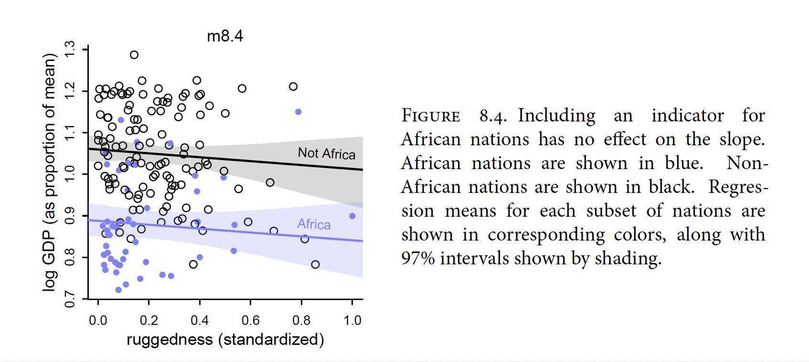

Conditioning is one of the most important principles of statistical inference. Data like the manatee scars and bomber damage, are conditional on how they get into our sample. 

Interaction: it is a kind of conditioning, a way of allowing parameters (really their posterior distributions) to be conditional on further aspects of the data. 

```{r}
library(rethinking) 
data(rugged)
d <- rugged
# make log version of outcome
d$log_gdp <- log( d$rgdppc_2000 )
# extract countries with GDP data
dd <- d[ complete.cases(d$rgdppc_2000) , ]
# rescale variables
dd$log_gdp_std <- dd$log_gdp / mean(dd$log_gdp)
dd$rugged_std <- dd$rugged / max(dd$rugged)
# split countries into Africa and not-Africa
d.A1 <- dd[ dd$cont_africa==1 , ] # Africa
d.A0 <- dd[ dd$cont_africa==0 , ] # not Africa
```


```{r}
d
```

```{r}
m8.1 <- quap(
alist(
log_gdp_std ~ dnorm( mu , sigma ) ,
mu <- a + b*( rugged_std - 0.215 ) ,
a ~ dnorm( 1 , 1 ) ,
b ~ dnorm( 0 , 1 ) ,
sigma ~ dexp( 1 )
) , data=d.A1 )
```

```{r}
set.seed(7)
prior <- extract.prior( m8.1 )
# set up the plot dimensions
plot( NULL , xlim=c(0,1) , ylim=c(0.5,1.5) ,
xlab="ruggedness" , ylab="log GDP" )

abline( h=min(dd$log_gdp_std) , lty=2 )
abline( h=max(dd$log_gdp_std) , lty=2 )
# draw 50 lines from the prior
rugged_seq <- seq( from=-0.1 , to=1.1 , length.out=30 )
mu <- link( m8.1 , post=prior , data=data.frame(rugged_std=rugged_seq) )
for ( i in 1:50 ) lines( rugged_seq , mu[i,] , col=col.alpha("black",0.3) )

```

```{r}
m8.1 <- quap(
alist(
log_gdp_std ~ dnorm( mu , sigma ) ,
mu <- a + b*( rugged_std - 0.215 ) ,
a ~ dnorm( 1 , 0.1 ) ,
b ~ dnorm( 0 , 0.3 ) ,
sigma ~ dexp(1)
) , data=d.A1 )
```

```{r}
set.seed(7)
prior <- extract.prior( m8.1 )
# set up the plot dimensions
plot( NULL , xlim=c(0,1) , ylim=c(0.5,1.5) ,
xlab="ruggedness" , ylab="log GDP" )

abline( h=min(dd$log_gdp_std) , lty=2 )
abline( h=max(dd$log_gdp_std) , lty=2 )
# draw 50 lines from the prior
rugged_seq <- seq( from=-0.1 , to=1.1 , length.out=30 )
mu <- link( m8.1 , post=prior , data=data.frame(rugged_std=rugged_seq) )
for ( i in 1:50 ) lines( rugged_seq , mu[i,] , col=col.alpha("black",0.3) )
```
```{r}
# Non-African nations
m8.2 <- quap(
alist(
log_gdp_std ~ dnorm( mu , sigma ) ,
mu <- a + b*( rugged_std - 0.215 ) ,
a ~ dnorm( 1 , 0.1 ) ,
b ~ dnorm( 0 , 0.25 ) ,
sigma ~ dexp(1)
) ,
data=d.A0 )

precis(m8.2)

set.seed(7)
prior <- extract.prior( m8.2 )
# set up the plot dimensions
plot( NULL , xlim=c(0,1) , ylim=c(0.5,1.5) ,
xlab="ruggedness" , ylab="log GDP" )

abline( h=min(dd$log_gdp_std) , lty=2 )
abline( h=max(dd$log_gdp_std) , lty=2 )
# draw 50 lines from the prior
rugged_seq <- seq( from=-0.1 , to=1.1 , length.out=30 )
mu <- link( m8.1 , post=prior , data=data.frame(rugged_std=rugged_seq) )
for ( i in 1:50 ) lines( rugged_seq , mu[i,] , col=col.alpha("black",0.3) )
```

```{r}
m8.3 <- quap( 
alist(
log_gdp_std ~ dnorm( mu , sigma ) ,
mu <- a + b*( rugged_std - 0.215 ) ,
a ~ dnorm( 1 , 0.1 ) ,
b ~ dnorm( 0 , 0.3 ) ,
sigma ~ dexp( 1 )
) ,
data=dd )

# make variable to index Africa (1) or not (2) 8.8
dd$cid <- ifelse( dd$cont_africa==1 , 1 , 2 )

m8.4 <- quap(
alist(
log_gdp_std ~ dnorm( mu , sigma ) ,
mu <- a[cid] + b*( rugged_std - 0.215 ) ,
a[cid] ~ dnorm( 1 , 0.1 ) ,
b ~ dnorm( 0 , 0.3 ) ,
sigma ~ dexp( 1 )
) ,
data=dd )

compare( m8.3 , m8.4 )
```
```{r}
precis(m8.4, depth=2)
```

```{r}
rugged.seq <- seq( from=-0.1 , to=1.1 , length.out=30 )
# compute mu over samples, fixing cid=2
mu.NotAfrica <- link( m8.4 ,
data=data.frame( cid=2 , rugged_std=rugged.seq ) )

# compute mu over samples, fixing cid=1
mu.Africa <- link( m8.4 ,
data=data.frame( cid=1 , rugged_std=rugged.seq ) )
# summarize to means and intervals
mu.NotAfrica_mu <- apply( mu.NotAfrica , 2 , mean )
mu.NotAfrica_ci <- apply( mu.NotAfrica , 2 , PI , prob=0.97 )
mu.Africa_mu <- apply( mu.Africa , 2 , mean )
mu.Africa_ci <- apply( mu.Africa , 2 , PI , prob=0.97 )
```



The African nations do have lower overall economic development, and so the blue regression line is below, but parallel to the black line. All including a dummy variable for Afrcan nations has done is allow the model to predict a lower mean fr African nations. 

### 8.1.3 Adding an interaction does work 

How can you recover the change in slope?

You need a proper interaction effect. (i.e. we make the slope coditional on continent)

$\mu_i$

$$
\mu_i=\alpha_{CID[i]}+\beta(r_i-\bar{r})
$$